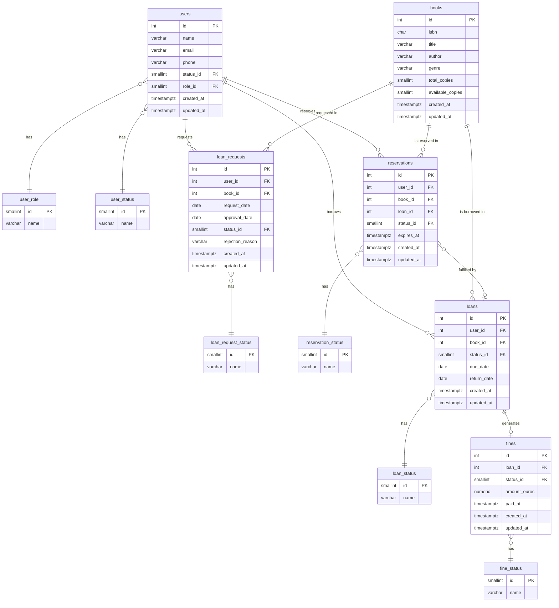

# Library Service

REST API for managing a library system — books, users, loan requests, loans, reservations and fines — built with **Spring Boot 3**, **Java 21** and **hexagonal architecture**.

---

## Tech Stack

| Layer | Technology |
|---|---|
| Language | Java 21 |
| Framework | Spring Boot 3.3.5 |
| Architecture | Hexagonal (Ports & Adapters) |
| Database | PostgreSQL 16 |
| ORM | MyBatis 3 |
| Migrations | Flyway |
| Mapping | MapStruct |
| Boilerplate | Lombok |
| API Spec | OpenAPI 3 / SpringDoc |
| Testing | JUnit 5 · Mockito · Instancio |
| Coverage | JaCoCo |

---

## Architecture

The project follows **hexagonal architecture** with strict separation between domain, application and infrastructure layers. The domain has zero dependencies on Spring or any infrastructure framework.

```
┌──────────────────────────────────────────────────────────────┐
│                        Infrastructure                         │
│                                                              │
│   REST Controllers ──► Input Ports (Use Cases)               │
│   Schedulers        ──► Input Ports (Use Cases)              │
│         │                       │                            │
│   MapStruct DTOs          Application Layer                  │
│                          (Use Case Impls,                    │
│                           Event Listeners)                   │
│                                 │                            │
│                           Domain Layer                       │
│                    (Models, Services, Ports)                 │
│                                 │                            │
│                    Output Ports (Persistence)                │
│                                 │                            │
│              MyBatis Repositories ──► PostgreSQL             │
└──────────────────────────────────────────────────────────────┘
```

```
domain/
├── model/          → Book, User, Loan, Reservation, Fine, LoanRequest (+ enums)
├── vo/             → Isbn (validated value object)
├── command/        → One command per use case (book/, user/, loan/, reservation/, fine/, loanrequest/)
├── event/          → LoanCreatedDomainEvent, LoanReturnedDomainEvent, LoanRequestApprovedDomainEvent
├── port/
│   ├── input/      → Use case interfaces + domain service interfaces
│   └── output/     → Persistence port interfaces
├── service/        → AuthorizationServiceImpl, LoanRequestPolicyValidationServiceImpl…
└── exception/      → LibraryException hierarchy

application/
├── usecase/        → One impl per use case (book/, user/, loan/, reservation/, fine/, loanrequest/)
└── event/          → Domain event listeners

infrastructure/
├── adapter/input/
│   ├── web/
│   │   ├── controller/ → One controller per operation
│   │   ├── dto/        → Generated from OpenAPI spec
│   │   ├── mapper/     → MapStruct mappers (request/response)
│   │   └── handler/    → GlobalExceptionHandler
│   └── scheduler/      → OverdueLoanScheduler, ExpiredReservationScheduler
└── adapter/output/
    ├── mybatis/    → MyBatis mappers with SQL
    ├── entities/   → JPA-free entity classes
    ├── mapper/     → Entity ↔ Domain MapStruct mappers
    └── repository/ → Persistence port implementations
```

---

## Database Schema



### Statuses

| Table | Values |
|---|---|
| `user_role` | `0` normal · `1` manager · `2` admin |
| `user_status` | `0` active · `1` suspended · `2` blocked |
| `loan_request_status` | `0` pending · `1` approved · `2` rejected · `3` cancelled |
| `loan_status` | `0` active · `1` returned · `2` overdue |
| `reservation_status` | `0` pending · `1` notified · `2` fulfilled · `3` expired · `4` cancelled |
| `fine_status` | `0` pending · `1` paid · `2` waived |

---

## Authorization

All mutating and sensitive endpoints require an `X-Requester-Id` header identifying the user performing the action. JWT authentication is not yet implemented — this header acts as a lightweight identity mechanism.

There are three roles with hierarchical permissions (`normal < manager < admin`):

| Role | Capabilities |
|---|---|
| `normal` | Read and manage own resources (loans, reservations, fines, loan requests) |
| `manager` | All normal actions + approve/reject loan requests + access any user's resources |
| `admin` | All manager actions + full system access |

The `AuthorizationService` exposes two checks used across use cases:

- `requireMinimumRole(requesterId, minimumRole)` — role must be ≥ the required level
- `requireOwnResourceOrRole(requesterId, resourceOwnerId, minimumRole)` — requester must own the resource or have sufficient role

---

## Domain Flows

### Loan Request → Loan (event-driven)

```
POST /loan-requests          → creates LoanRequest (PENDING)
                               validates: no pending fines, active loan limit < 3, book not available for direct loan
PATCH /loan-requests/{id}    → manager approves → status: APPROVED
                               publishes LoanRequestApprovedDomainEvent
                             → LoanCreationOnRequestApprovedEventListener
                               creates Loan (ACTIVE, due in 2 weeks)
                               publishes LoanCreatedDomainEvent
                             → ReservationFulfillmentEventListener
                               marks user's reservation as FULFILLED (if any)
```

### Loan Return → Reservation Notification (event-driven)

```
PATCH /loans/{id}/return     → updates Loan (RETURNED)
                               calculates overdue fine via FineCalculationService
                               creates or updates fine via FineManagementService (if overdue)
                               publishes LoanReturnedDomainEvent
                             → ReservationNotificationEventListener
                               marks next pending reservation for the book as NOTIFIED
```

### Scheduled Jobs (daily at midnight)

| Job | Action |
|---|---|
| `OverdueLoanScheduler` | Marks all active loans past their due date as `OVERDUE` |
| `ExpiredReservationScheduler` | Marks all notified reservations past their expiry as `EXPIRED` |

---

## API Endpoints

Base path: `/v1/library`

All write endpoints accept `X-Requester-Id: {userId}` header.

### Books

| Method | Endpoint | Description | Auth |
|---|---|---|---|
| `GET` | `/books` | List all books | — |
| `POST` | `/books` | Create a book | manager+ |
| `PATCH` | `/books/{id}` | Update book | manager+ |
| `DELETE` | `/books/{id}` | Delete book | admin |

**POST /books — request body**
```json
{
  "isbn": "9780132350884",
  "title": "Clean Code",
  "author": "Robert C. Martin",
  "genre": "Software Engineering",
  "totalCopies": 5,
  "availableCopies": 5
}
```

### Users

| Method | Endpoint | Description | Auth |
|---|---|---|---|
| `GET` | `/users` | List all users | manager+ |
| `POST` | `/users` | Create a user | — |
| `PATCH` | `/users/{id}` | Update user | own resource or manager+ |
| `DELETE` | `/users/{id}` | Delete user | admin |

**POST /users — request body**
```json
{
  "name": "John Doe",
  "email": "john.doe@example.com",
  "phone": "+34 600 000 000"
}
```

### Loan Requests

| Method | Endpoint | Description | Auth |
|---|---|---|---|
| `GET` | `/loan-requests` | List all loan requests | manager+ |
| `POST` | `/loan-requests` | Submit a loan request | normal+ |
| `GET` | `/loan-requests/{id}` | Get loan request by id | own resource or manager+ |
| `PATCH` | `/loan-requests/{id}` | Update loan request status | own (cancel) or manager+ (approve/reject) |

**POST /loan-requests — request body**
```json
{
  "userId": 1,
  "bookId": 42,
  "requestDate": "2025-01-15"
}
```

**PATCH /loan-requests/{id} — request body**
```json
{
  "status": "APPROVED",
  "approvalDate": "2025-01-16",
  "rejectionReason": null
}
```

Approval/rejection requires `manager+`. Cancellation requires owning the request or `manager+`.

### Loans

| Method | Endpoint | Description | Auth |
|---|---|---|---|
| `GET` | `/loans` | List all loans | manager+ |
| `POST` | `/loans` | Create a loan directly | manager+ |
| `GET` | `/loans/{id}` | Get loan by id | own resource or manager+ |
| `PATCH` | `/loans/{id}/return` | Return a loan | own resource or manager+ |
| `PATCH` | `/loans/{id}/renew` | Renew a loan | own resource or manager+ |
| `GET` | `/users/{id}/loans` | Get all loans for a user | own resource or manager+ |

**PATCH /loans/{id}/return — request body**
```json
{
  "returnDate": "2025-01-20"
}
```

The return flow calculates fine amount (days overdue × rate) and creates or updates a pending fine automatically when applicable.

### Reservations

| Method | Endpoint | Description | Auth |
|---|---|---|---|
| `GET` | `/reservations` | List all reservations | manager+ |
| `POST` | `/reservations` | Create a reservation | normal+ |
| `GET` | `/reservations/{id}` | Get reservation by id | own resource or manager+ |
| `PATCH` | `/reservations/{id}` | Update reservation | own resource or manager+ |
| `GET` | `/users/{id}/reservations` | Get all reservations for a user | own resource or manager+ |

### Fines

| Method | Endpoint | Description | Auth |
|---|---|---|---|
| `GET` | `/fines` | List all fines | manager+ |
| `POST` | `/fines` | Create a fine manually | manager+ |
| `GET` | `/fines/{id}` | Get fine by id | own resource or manager+ |
| `PATCH` | `/fines/{id}` | Update fine (pay, waive) | own (pay) or manager+ (waive) |
| `GET` | `/users/{id}/fines` | Get all fines for a user | own resource or manager+ |

---

## Error Handling

All errors return a consistent body:

```json
{
  "code": "LIB-AUTH-001",
  "message": "Error: You do not have permission to perform this action"
}
```

| Exception | HTTP Status | When |
|---|---|---|
| `ForbiddenActionException` | `403 Forbidden` | Insufficient role or accessing another user's resource |
| `IsbnException` | `400 Bad Request` | Invalid ISBN-13 format |
| `LoanException` (policy) | `400 Bad Request` | User blocked, book unavailable, book retired |
| `LoanRequestException` (policy) | `400 Bad Request` | Pending fines, loan limit reached, book available for direct loan, invalid status transition |
| `BookException` | `404 Not Found` | Book not found |
| `UserException` | `404 Not Found` | User not found |
| `LoanException` | `404 Not Found` | Loan not found |
| `LoanRequestException` | `404 Not Found` | Loan request not found |
| `ReservationException` | `404 Not Found` | Reservation not found |
| `FineException` | `404 Not Found` | Fine not found |

Error codes follow the pattern `LIB-{DOMAIN}-{NUMBER}` (e.g. `LIB-BOOK-001`, `LIB-AUTH-002`).

---

## Getting Started

### Prerequisites

- Java 21
- Maven 3.9+
- Docker & Docker Compose

### 1. Start the database

```bash
docker-compose up -d
```

This starts a PostgreSQL 16 instance on port `5433`. Flyway runs migrations automatically on application startup.

### 2. Run the application

```bash
mvn spring-boot:run -Dspring-boot.run.profiles=local
```

Or build and run the JAR:

```bash
mvn clean package -DskipTests
java -jar target/library-0.0.1-SNAPSHOT.jar --spring.profiles.active=local
```

### 3. Swagger UI

Once running, the API docs are available at:

```
http://localhost:8080/swagger-ui.html
```

---

## Environment Variables

| Variable | Default | Description |
|---|---|---|
| `DB_HOST` | `localhost` | PostgreSQL host |
| `DB_PORT` | `5433` | PostgreSQL port |
| `DB_NAME` | `library_db` | Database name |
| `DB_USERNAME` | `library_user` | Database user |
| `DB_PASSWORD` | `library_pass` | Database password |

---

## Running Tests

```bash
mvn test
```

Coverage report is generated at `target/site/jacoco/index.html`.

---

## ISBN Validation

The `Isbn` value object validates ISBN-13 format on creation:

- Must start with `978` or `979`
- Accepts dashes and spaces (normalized internally)
- Check digit validated using the EAN-13 algorithm
- Throws `IsbnException` (`400 Bad Request`) on invalid input
