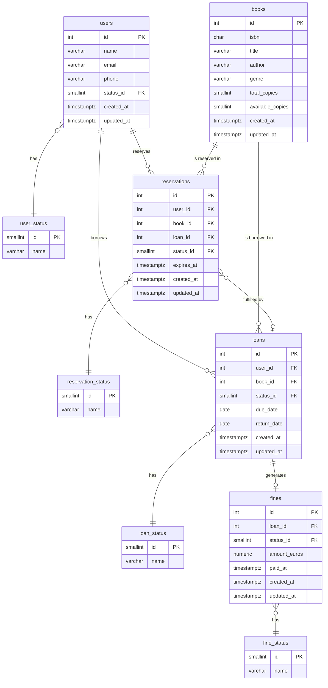

# Library Service

REST API for managing a library system — books, users, loans, reservations and fines — built with **Spring Boot 3**, **Java 21** and **hexagonal architecture**.

---

## Tech Stack

| Layer | Technology |
|---|---|
| Language | Java 21 |
| Framework | Spring Boot 3.3.5 |
| Architecture | Hexagonal (Ports & Adapters) |
| Database | PostgreSQL 16 |
| ORM | MyBatis 3 |
| Migrations | Flyway |
| Mapping | MapStruct |
| Boilerplate | Lombok |
| API Spec | OpenAPI 3 / SpringDoc |
| Testing | JUnit 5 · Mockito · Instancio |
| Coverage | JaCoCo |

---

## Architecture

The project follows **hexagonal architecture** with a strict separation between domain, application and infrastructure layers.

```
┌─────────────────────────────────────────────────────────┐
│                    Infrastructure                        │
│                                                         │
│   REST Controllers ──► Use Case Ports (Input)           │
│        │                      │                         │
│   MapStruct DTOs        Application Layer               │
│                               │                         │
│                         Domain Layer                    │
│                         (Book, User, Isbn VO)           │
│                               │                         │
│                   Persistence Ports (Output)            │
│                               │                         │
│              MyBatis Repositories ──► PostgreSQL        │
└─────────────────────────────────────────────────────────┘
```

```
domain/
├── model/          → Book, User, UserStatus
├── vo/             → Isbn (validated value object)
├── command/        → CreateBookCommand, UpdateUserCommand…
├── port/
│   ├── input/      → Use case interfaces
│   └── output/     → Persistence port interfaces
└── exception/      → LibraryException, BookException, UserException, IsbnException

application/
└── usecase/        → CreateUserUseCaseImpl, UpdateBookUseCaseImpl…

infrastructure/
├── adapter/input/web/
│   ├── controller/ → One controller per operation
│   ├── dto/        → Generated from OpenAPI spec
│   ├── mapper/     → MapStruct mappers (request/response)
│   └── handler/    → GlobalExceptionHandler
└── adapter/output/
    ├── mybatis/    → MyBatis mappers with SQL
    ├── entities/   → BookEntity, UserEntity
    ├── mapper/     → Entity ↔ Domain mappers
    └── repository/ → Port implementations
```

---

## Database Schema



### Statuses

| Table | Values |
|---|---|
| `user_status` | `0` active · `1` suspended · `2` blocked |
| `loan_status` | `0` active · `1` returned · `2` overdue |
| `reservation_status` | `0` pending · `1` notified · `2` fulfilled · `3` expired · `4` cancelled |
| `fine_status` | `0` pending · `1` paid · `2` waived |

---

## API Endpoints

Base path: `/v1/library`

### Books

| Method | Endpoint | Description | Response |
|---|---|---|---|
| `GET` | `/books` | List all books | `200 GetBooksV1Response` |
| `POST` | `/books` | Create a book | `201 BookV1Response` |
| `GET` | `/books/{id}` | Get book by ID | `200 BookV1Response` |
| `PATCH` | `/books/{id}` | Update book | `200 BookV1Response` |
| `DELETE` | `/books/{id}` | Delete book | `204` |

**POST /books — request body**
```json
{
  "isbn": "9780132350884",
  "title": "Clean Code",
  "author": "Robert C. Martin",
  "genre": "Software Engineering",
  "totalCopies": 5,
  "availableCopies": 5
}
```

### Users

| Method | Endpoint | Description | Response |
|---|---|---|---|
| `GET` | `/users` | List all users | `200 GetUsersV1Response` |
| `POST` | `/users` | Create a user | `201 UserV1Response` |
| `GET` | `/users/{id}` | Get user by ID | `200 UserV1Response` |
| `PATCH` | `/users/{id}` | Update user | `200 UserV1Response` |
| `DELETE` | `/users/{id}` | Delete user | `204` |

**POST /users — request body**
```json
{
  "name": "John Doe",
  "email": "john.doe@example.com",
  "phone": "+34 600 000 000"
}
```

### Error Response

All errors return a consistent body:
```json
{
  "code": "LIB-BOOK-001",
  "message": "Book not found"
}
```

| Exception | HTTP Status |
|---|---|
| `IsbnException` | `400 Bad Request` |
| `BookException` / `UserException` | `404 Not Found` |

---

## Getting Started

### Prerequisites

- Java 21
- Maven 3.9+
- Docker & Docker Compose

### 1. Start the database

```bash
docker-compose up -d
```

This starts a PostgreSQL 16 instance on port `5433`. Flyway runs migrations automatically on startup.

### 2. Run the application

```bash
mvn spring-boot:run -Dspring-boot.run.profiles=local
```

Or build and run the JAR:

```bash
mvn clean package -DskipTests
java -jar target/library-0.0.1-SNAPSHOT.jar --spring.profiles.active=local
```

### 3. Swagger UI

Once running, the API docs are available at:

```
http://localhost:8080/swagger-ui.html
```

---

## Environment Variables

| Variable | Default | Description |
|---|---|---|
| `DB_HOST` | `localhost` | PostgreSQL host |
| `DB_PORT` | `5433` | PostgreSQL port |
| `DB_NAME` | `library_db` | Database name |
| `DB_USERNAME` | `library_user` | Database user |
| `DB_PASSWORD` | `library_pass` | Database password |

---

## Running Tests

```bash
mvn test
```

Coverage report is generated at `target/site/jacoco/index.html`.

---

## ISBN Validation

The `Isbn` value object validates ISBN-13 format on creation:

- Must start with `978` or `979`
- Accepts dashes and spaces (normalized internally)
- Check digit validated using the EAN-13 algorithm
- Throws `IsbnException` (400) on invalid input
